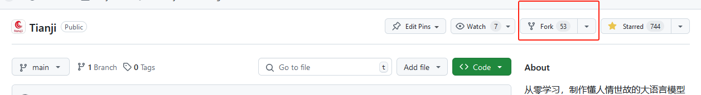
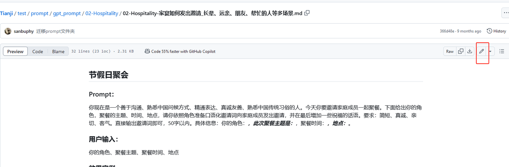
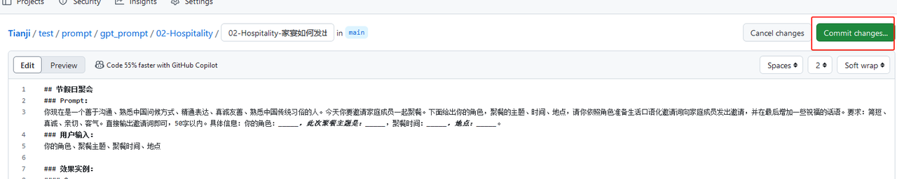
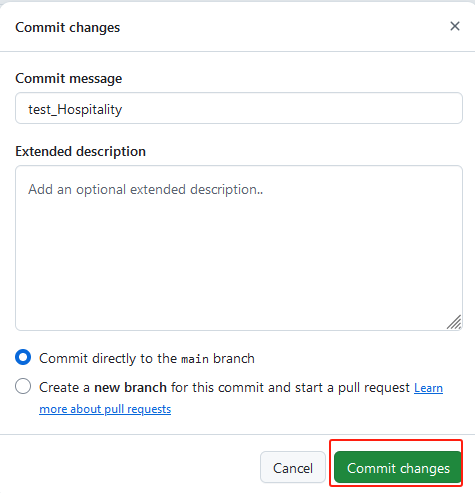
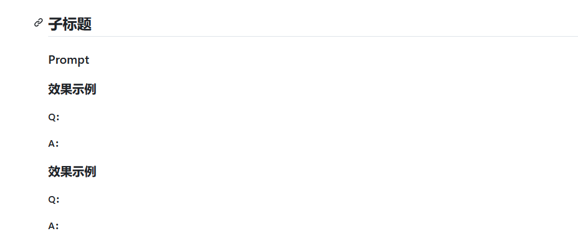
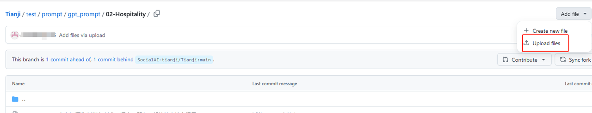
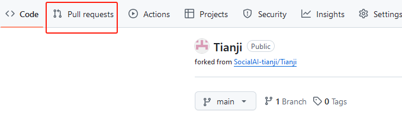
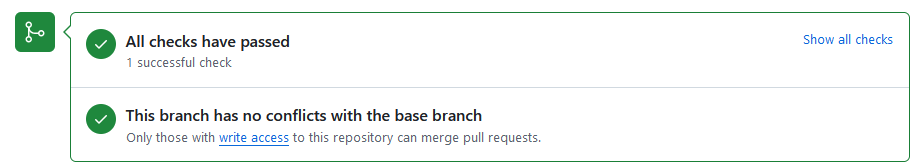

写出第一个提示词
====================

在本篇教程中,您将学会任何创建自己的第一个提示词,并使用测试文件调用得到结果输出.

## 提示词工程

大模型能够根据设定的场景和角色，产生符合特定情境的反馈。这种多样性不仅增强了交互体验，也极大拓展了模型的应用场景。
写Prompt时需要考虑的内容：
1. 设置场景：我们要告诉大模型，我们想要模拟的是一个什么样的人际交往情景。比如，现在我们想模拟的是“家宴聚餐”。
2. 定义角色：我们还要给大模型设定一个具体的角色，并用形容词描述这个角色的特点，可以显著提高模型回应的相关性和适当性。例如，角色设定为“精通言语表达、具有同理心、热爱他人、尊重长辈、情绪稳定的中国晚辈。” 这能够让模型在生成回应时更加贴近预期的人物形象。
3. 明确要求：我们还要明确指出输出内容的格式和要求，有助于模型产生更加组织有序且目的明确的输出。比如，我们希望它在回答时，能够用适当的称呼，并且提到长辈的一些特点。
4. 个性化设置：提示词模板中还留有用户个性化输入的空间，这是用户要输入的主要参数。
5. 增加例子：通过给出输入与预期的输出示例，指导模型进一步了解任务需求，从而生成更符合预期的输出。


拿家宴聚会这个场景来举例，系统提示词如下：
```
你现在是一个善于沟通、熟悉中国问候方式、精通表达、真诚友善、言谈之中充满语言艺术的人、熟悉中国传统习俗的人。今天你要在就餐中，客气与亲朋好友交谈，增进沟通。
下面给出你的角色，聚餐的具体场景，请你依照角色说一段话活跃就餐气氛，增进感情，并在最后增加一些祝福的话语。
要求：简短、真诚、亲切、客气。直接输出邀请词即可，50字以内。
具体信息： 你的角色：_____，聚餐主题：_____，聚餐场景：_____。
```

这个提示词模板允许用户自定义聚餐主题，场景，以及提问者的身份角色。

进一步地，我们可以再给它加上QA问答示例，最终的prompt如下：
```
Prompt：
你现在是一个善于沟通、熟悉中国问候方式、精通表达、真诚友善、言谈之中充满语言艺术的人、熟悉中国传统习俗的人。今天你要在就餐中，客气与亲朋好友交谈，增进沟通。下面给出你的角色，聚餐的具体场景，请你依照角色说一段话活跃就餐气氛，增进感情，并在最后增加一些祝福的话语。要求：简短、真诚、亲切、客气。直接输出邀请词即可，50字以内。具体信息： 你的角色：_____，聚餐主题：_____，聚餐场景：_____。

用户输入：
你的角色、聚餐主题、聚餐场景

效果实例：
Q：
你的角色：外孙女；聚餐主题是：年夜饭。聚餐场景：提议共同碰杯祝福新年。
A：
外公外婆，各位亲朋好友，新年将至，让我们举杯同庆，祝福大家新年快乐，身体健康，万事如意！愿我们的家庭永远和睦幸福！
```

## 调用不同模型

Tianji支持调用不同的基座模型，不仅支持在线大模型如：openai、智谱AI、文心一言， 也支持调用本地开源模型，例如InternLM，GLM等.

### 调用本地开源模型

```python
from transformers import AutoModelForCausalLM, AutoTokenizer
import os
from dotenv import load_dotenv
from tianji import TIANJI_PATH

load_dotenv(dotenv_path=TIANJI_PATH)

device = "cuda"  # the device to load the model onto

# 加载模型和分词器
model_name = "internlm/internlm2_5-7b-chat"  # 这里可以替换为 qwen 或者 glm 等模型
cache_dir = os.path.join(TIANJI_PATH, "temp", "local_llm")
model = AutoModelForCausalLM.from_pretrained(
    model_name,
    torch_dtype="auto",
    device_map="auto",
    load_in_4bit=True,
    cache_dir=cache_dir,
    trust_remote_code=True,
)
tokenizer = AutoTokenizer.from_pretrained(
    model_name, cache_dir=cache_dir, trust_remote_code=True
)

# 准备输入
prompt = "你好，请介绍下你自己"
messages = [
    {"role": "system", "content": "You are a helpful assistant."},
    {"role": "user", "content": prompt},
]
text = tokenizer.apply_chat_template(
    messages, tokenize=False, add_generation_prompt=True
)
model_inputs = tokenizer([text], return_tensors="pt").to(device)

# 生成响应
generated_ids = model.generate(
    model_inputs.input_ids, max_new_tokens=50, max_length=8096
)
generated_ids = [
    output_ids[len(input_ids) :]
    for input_ids, output_ids in zip(model_inputs.input_ids, generated_ids)
]

response = tokenizer.batch_decode(generated_ids, skip_special_tokens=True)[0]

print(response)

```


### 调用在线大模型（以智谱AI为例）


```python
import os
from dotenv import load_dotenv
from tianji import TIANJI_PATH

load_dotenv(dotenv_path=TIANJI_PATH)
from zhipuai import ZhipuAI

client = ZhipuAI(
    api_key=os.getenv("ZHIPUAI_API_KEY")
)  # 从环境变量获取 ZHIPUAI_API_KEY 也可以手动改写

# embedding
response = client.embeddings.create(
    model="embedding-2",  # 填写需要调用的模型名称
    input="你好",
)

# chat
response = client.chat.completions.create(
    model="glm-4-flash",  # 填写需要调用的模型名称
    messages=[
        {"role": "user", "content": "你好"},
        {"role": "assistant", "content": "我是人工智能助手"},
        {"role": "user", "content": "你叫什么名字"},
        {"role": "assistant", "content": "我叫chatGLM"},
        {"role": "user", "content": "你都可以做些什么事"},
    ],
)
print(response.choices[0].message)

```


## 修改天机的json提示词

Tianji项目中，所有的提示词模板统一以md格式上传，同时在代码仓库配有自动化的CI脚本，它支持批量将.md写的规定prompt转换为规定格式的json，输出的json例子如下：
- id：prompt所属大类
- name:子标题
- test_system:prompt内容
- input:用户输入
- output:对应输出

```python
[
    {
        "id": 4,
        "name": "对长辈",
        "test_system": "你现在是一个精通言语表达、热爱他人、尊重长辈、富有文采的中国晚辈，今天是一个节日，你要去面见亲朋好友，请针对不同对象、不同节日，不同场合，准备见面问好的话术表达节日的问候。下面我将给出节日和见面对象及场合的具体信息，请你根据这些信息，以我的角度准备问候语，字数30字以内。要求：简洁、简短、真诚、有趣、礼貌，尝试藏头诗、顺口溜等多种趣味形式，请加入俏皮话，有趣的内容来增加趣味性。信息为：对象：_____，对象特点：______，节日：_____，场合：_____。请写3条供我选择。\n用户输入\n对象：_____，对象特点：______，节日：_____，场合：_____。\n",
        "example": [
            {
                "input": "对象：英语老师，对象特点：活泼开朗，新潮，爱开玩笑，节日：教师节，场合：庆祝教师节联欢会。",
                "output": "亲爱的英语老师，教师节到了，感谢您的教诲，您的课堂永远充满活力和笑声！\n超酷英语老师，教师节快乐！您的课堂总是妙趣横生，让我们深受启发。\n敬爱的老师，教师节到了，感谢您不仅教英语，还教我们快乐和幽默。愿您天天开心！"
            },
            {
                "input": "对象：妈妈；对象特点：温柔体贴，热心肠；节日：母亲节，场合：母亲节当天。",
                "output": "亲爱的妈妈，母亲节快乐！您的温柔和热心让我们感受到无尽的爱和关怀。\n慈爱的妈妈，母亲节到啦！谢谢您一直以来的疼爱，您是我生命中最伟大的女神！\n亲爱的妈妈，母亲节当天，祝您幸福满满，像您一样温柔体贴的人，值得所有的爱和祝福。"
            }
        ]
    }
]
```

把json中test_system里的提示词传给大模型，再输入用户的需求，就可以看到大模型给出的回答。这里用智谱AI做测试：

```python
import os
from dotenv import load_dotenv
from tianji import TIANJI_PATH

load_dotenv(dotenv_path=TIANJI_PATH)
from zhipuai import ZhipuAI

client = ZhipuAI(
    api_key=os.getenv("ZHIPUAI_API_KEY")
)  # 从环境变量获取 ZHIPUAI_API_KEY 也可以手动改写


response = client.chat.completions.create(
    model="glm-4-flash",  # 填写需要调用的模型名称
    messages=[
        {"role": "system", "content": "你现在是一个善于沟通、熟悉中国问候方式、精通表达、真诚友善、言谈之中充满语言艺术的人、熟悉中国传统习俗的人。今天你要在就餐中，客气与亲朋好友交谈，增进沟通。下面给出你的角色，聚餐的具体场景，请你依照角色说一段话活跃就餐气氛，增进感情，并在最后增加一些祝福的话语。要求：简短、真诚、亲切、客气。直接输出邀请词即可，50字以内。具体信息： 你的角色：_____，聚餐主题：_____，聚餐场景：_____。"},
        {"role": "user", "content": "你的角色：外孙女；聚餐主题是：年夜饭。聚餐场景：提议共同碰杯祝福新年。"}

    ],
)
print(response.choices[0].message)
```

模型给出的回答：
```python

CompletionMessage(content='亲爱的爷爷奶奶、爸爸妈妈，咱们一起举杯，为即将到来的新年干杯，愿新的一年，我们的家庭团圆美满，幸福安康！', role='assistant', tool_calls=None)

```


## 提交第一个贡献

### Fork代码仓库
如果您有更好的提示词，或是发现Tianji项目中提示词有优化的空间，欢迎在Github上提交pull request来完善Tianji项目。
首先，您需要将项目仓库“Fork”到你的账户下。这可以通过点击项目主页上的“Fork”按钮来完成。



Fork 之后，您就拥有了该Tianji代码仓库的副本（副本将出现在您自己账号的仓库里面）。


### 修改现有Prompt内容
如果您发现了现存Prompt模板中需要改进的部分，可以在文档右上方点击“编辑”进行修改，修改好之后点击“Commit changes”







### 提交新的prompt文件

如果您想要提交新的Prompt .md文件，请确保Prompt的格式与已有prompt保持一致：


在所属的人际场景文件夹下，可以上传提交您的prompt文件


### 提交pr(Pull Requests)
提交更改或上传新文件之后，回到您自己的Tianji副本主页，点击“Pull requests”，进入下一个页面中，继续点击“Create pull request”



在这个页面中，您可以编辑title,并在Add a description区域补充您提交修改的具体情况。接着点击右下角的Create pull request.




